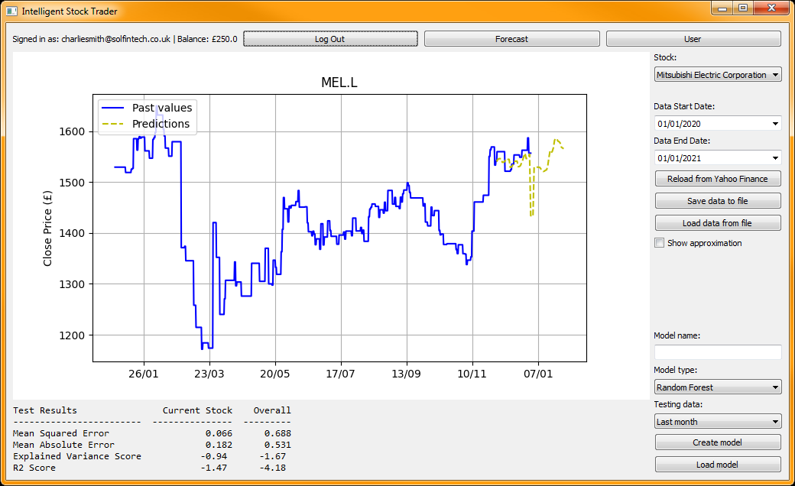

# Stock Trader
The Stock Trader is a machine learning application written in Python and using scikit-learn to forecast future values of stock prices.
It was created as part of a 2020 machine learning course at Solent University.

# Contents
1. Overview
2. User Guide
3. Design and Implementation

# Overview
The Stock Trader is a Python application packaged as a Windows executable. It uses a Multilayer Perceptron model to analyse stock data from Yahoo Finance and provide predictions of stock prices on specified future dates. This prediction information is displayed in a chart.

# User Guide
## User Management

A simple user managing system is included in the application.

---

*WARNING* This implementation is unsecured and should not be used in a production environment. Do not store sensitive details in this system.

---

### Login
When starting the application, the user is prompted to sign in. Enter valid details for a registered user. The example accounts are included in the file [users.csv](../../data/users.csv). A new account can also be created by clicking 'Register'.
Alternatively, select 'Continue as Guest' to sign in using a guest account. The guest account has no funds by default. For [investment suggestions](#InvestmentSuggestions) you must first add funds through the [user page](#UserPage).

### Registration
Through the registration page, new a new account can be created. Fill in the form and select 'Register'. New accounts have a default balance of £0. This can be changed from the [user page](#UserPage) after signing in.

A new user cannot share a username with an existing user. There are no size or character requirements for passwords and they are stored in an unsecured plaintext file.

### User Page
After signing-in to the application, the user can navigate to the user page. From here the user can update their username and password, or add funds to their account.

## Chart
The chart page is the main view of the application. It features a large canvas for displaying stock prices overtime and predictions for future values. On the right side are controls for loading data and training machine learning models.

1. When data is loaded in the application, a dropdown box lists the stocks available. Selecting a stock in this box will display it on the graph.
2. The data control section provides options to load data into the application. The date selector boxes allow the user to specify the range of data to be loaded from the chosen source. See [Loading Data](#LoadingData) for more information.
3. The model training section allows the creation and persistance of machine learning models based on the loaded data. The type of model to train can be chosen in the dropdown box. A previously trained model can also be loaded by entering it's name in the model name field and clicking "Load model".

## Loading Data
Before the application can perform any machine learning or forecasting, stock data must be loaded. The application is designed to load this data from either Yahoo Finance or a local CSV file.
### Yahoo Finance
Historical stockmarket data can be loaded from Yahoo Finance. Clicking the "Load from Yahoo Finance" button on the chart page will automatically retrieve the data from the given timeframe for a specific set of stocks. The stocks to be loaded are stored in [stocksymbols.csv](../../data/stocksymbols.csv).
Once loaded, this data can be saved to a local file to be easily accessed again by clicking "Save to local file". This will create or overwrite "localstorage.csv" in the data directory.

### Local CSV File
Stockmarket data can be loaded from a local CSV file by clicking the "Load from local file" button. This loads "data/localstorage.csv".

## Forecasting
TBC

## Investment Suggestions
Users can enter a desired amount of profit and a timeframe in which to achieve it on the Suggest tab of the Forecast page. The system will then use the loaded data and model to propose a series of future transactions that will give the desired result.
Users will require enough funds in their account to purchase the cheapest available stock in the data.

# Design and Implementation
TBC

## Machine Learning

## Use Cases

## Wireframes

## Data Flow

## Class Diagram

## Technologies and Libraries used
- Python
- scikit-learn
- yahoofinancials
- matplotlib
- PyQt5